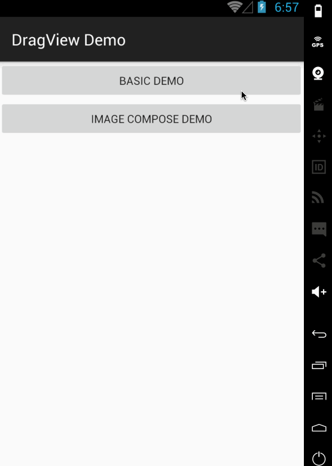

# DragView

Drag view library for Android

# Screenshot



# Setup

* In your `build.gradle` :

```gradle
repositories {
    maven { url "https://jitpack.io" }
}

dependencies {
    compile 'com.github.nanjingboy:DragView:1.0.0'
}
```

* [Sample](sample/src/main)

# License

MIT